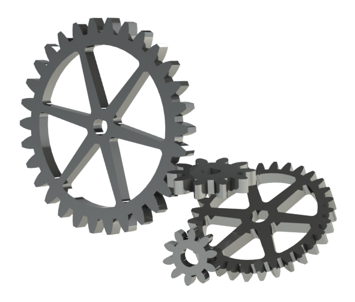

# Solidworks

## Gears
### Description
In this assignment I had to use global variables to make 4 different gears. I made one gear at first, using equations as the dimentions, and then I made different configurations. For these configurations, I changed the global variables to make them have different ammounts of teeth, and to have them be different sizes. I then used equations again to make triangle-ish cuts in the gears and I also added a D shapd cut to the middle. 
### Picture

### Problems and Lessons Learned
In this assignment I learned how to use global variables and also how they can make it so much easier. They make it so you don't have to put in exact numbers for dimensions, and that you can instead use equations with variables you already set up. One problem i had in this assignment was that my 2 smaller 1.0 module gears ended up looking really funky. They were basically just rings. I realized after as bit that i forgot to do equal spacing for the cut that makes the teeth, so the spacing between them was all messed up for these configurations. After I fixed that I was done. i also learned about the different ratios for gears and what all the different parts are called and how they affect what you end up with.

## Gearbox
### Description
In this assignment i had to make an axle with two configurations, a spacer with four configurations, and a knob. I used the different conigurations of these things to make 3 different assemblies with the different gears from the previous assignment. I then had to make a plate that would hold them all together. This was the hardest part because I had to make it so all the gears meshed together perfectly. In the end I had a gearbox that when i turn the knob, all the gears turn together with it. To do this i had to use gear mates.
### Picture

### Problems and Leassons Learned
The main problem I had with this assignment was getting the plate to be right. To do this I had to calculate all the pitch diameters of the different gears, and add up the ones that were to mesh together. I then had to use that sum as the distance between the holes for those assemblies. This took a lot of tries because I kept messing up math and just making the distances a little off. After i fixed the plate I ran into a problem with the gear mates. I didn't know that you had to use a ratio between the gears to make them mesh right, so mine were going into eachother as they turned. I then got some help and realized that you need to make a ratio. I learned that the ratio is just the pitch diameter of the two gears. 

## Motion Study
### Description
In this assignment i had to make a base, s bracket, a clip, a servo arm, a mount, and a shelf. the parts themselves weren't that hard to make. After i made them all I put them together with a servo in an assembly. I then had to make a motion study that made it so the servo would turn and it would carry the shelf up with it. I did this my adding a motor, gravity, and contacts. the contacts made it so pieces wouldnt go through eachother, and that they would instead move together naturally. 
### Picture

### Lessons learned
My main problem in this assigg=nment was getting the motor t work. i would spin the servo in the wrong direction and when i changed the direction it wouldn't do anything. I just deleted the motor and made it again and it worked. I also had a problem with the view orientation. I must have been moving the part during the study because the view was moving all over the place. i fixed this by deleting all the view orientation points and making new ones from an angle i preferred. 

## Stress Analysis
### Description
In this assignment i made a servo arm looking part. I then used a simulation to add a force to it. This force made it bend because it was being pushed at the tip. My job was to design a similar part that would have a low FOS of 1-2 and still be under 525grams. My final part was like 514grams and had a low FOS of around 1.9. I did this by making a cut on one side of the part then mirroring it to make a little section in the middle for extra support. 
### Picture

### Lessons learned
At first i had my force a little messed up because my fixture was in the wrong place. I fixed this by simply selecting the inner face of the larger hole. i then had trouble making the perfect part because the FOS was always too low. Mr.H helped me with this by giving the idea of leaving some material in the middle for support. This made my part a lot sturdier. This assignment helped me learn how to make a part that isn't too bulky, but can still handle a force without breaking. I also learned what an FOS is(factor of safety) and why it is important. 
